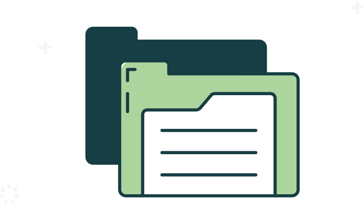

<h1 align="center">
  
</h1>

<h5 align="center">
  <code><a href="https://nxn404-n.github.io/Portfolio-M1/" title="Portfolio"> Portfolio</a></code>
  <code><a href="https://www.linkedin.com/in/nafeurrahmanadil/" title="LinkedIn Profile"> LinkedIn</a></code>
  <code><a href="https://twitter.com/nxn_404" title="Twitter Profile"> Twitter</a></code>
</h5>
 

  Hi, I'm Nafeur Rahman Adil, I'm a front-end web Developer, and I'm looking for exciting job opportunities.
   
  (*Available for hire*)
   
   
  🔬 I'm currently learning nodejs, expressjs and mongoDB.
   
  💻 I love writing code and learn new languages and frameworks.
   
  🧩 I love solving coding problems
   
  💬 Ask me anything about from <a href="https://github.com/nxn404-n/nxn404-n/issues" title="Issues">Here</a>
   
  Here is my portfolio: <a href="https://nafeurrahmanadil.netlify.app/" target="_blank">Portfolio</a>
   
  📫 Here is my email: <a href="mailto: nafeurrahmanadil@gmail.com">nafeurrahmanadil@gmail.com</a>

<h2 align="center">🔥 Languages & Frameworks & Tools & Abilities 🔥</h2>
 

  <code></code>
  <code></code>
  <code></code>
  <code></code>
  <code></code>
  <code></code>
  <code></code>
  <code></code>
  <code></code>

<h2 align="center">⚡ Stats ⚡</h2>
 

  

  
  

  

   

  

    
    
  

